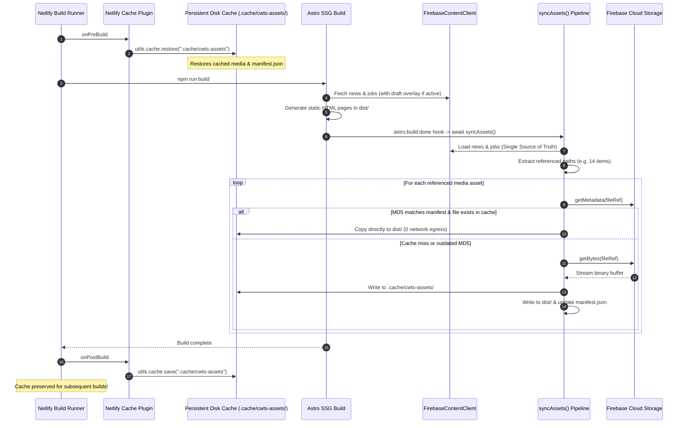
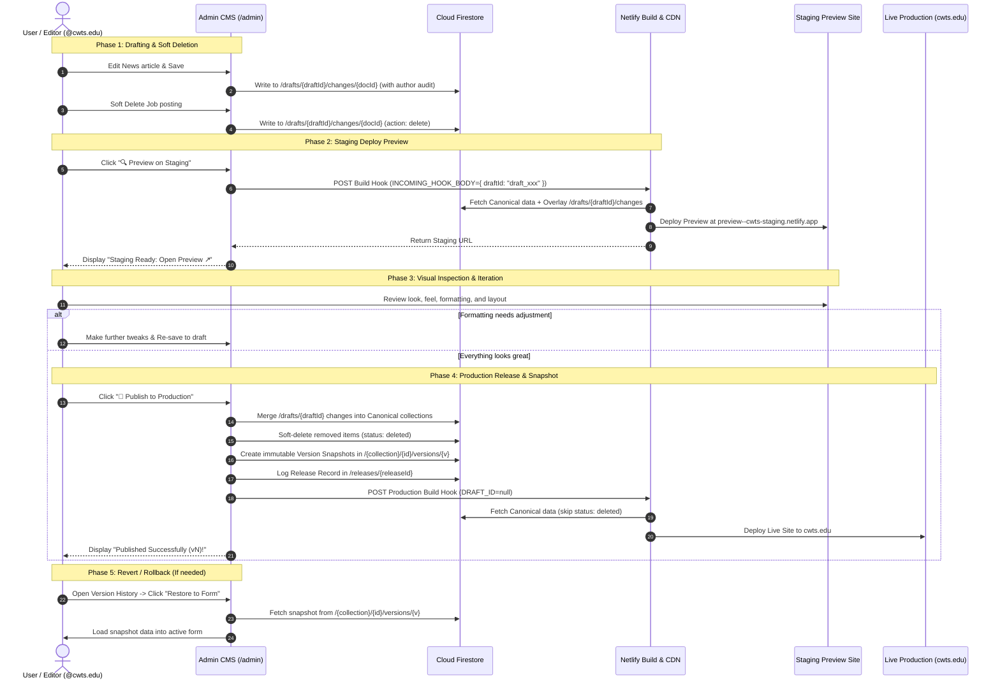
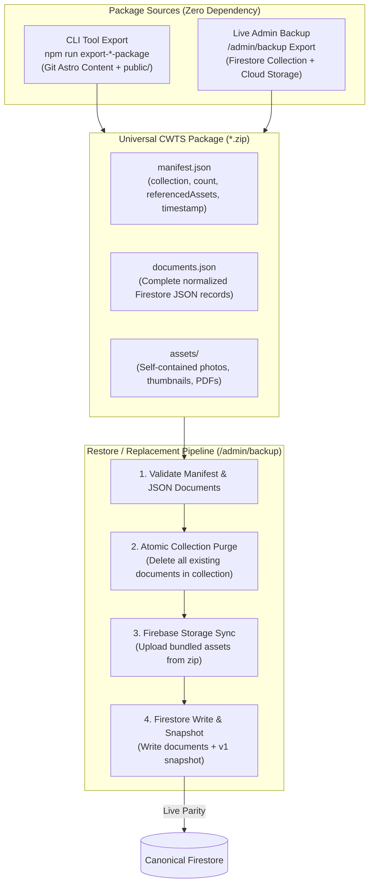
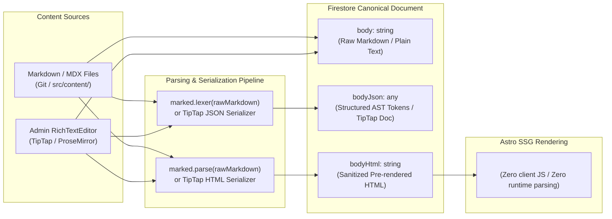
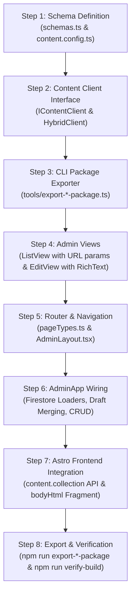

# Headless CMS Architecture & Progressive Migration Design Document

**Project:** Christian Witness Theological Seminary (CWTS) Website  
**Topic:** Headless CMS on Firebase Blaze Plan (Operating 100% Within Included No-Cost Quotas), Unified Admin Webapp (`cwts.edu/admin`), Direct Content Interface, Media Library & In-Browser Cropper, Draft Workspaces, Netlify Staging Preview, Immutable Version History & Production Release Pipeline  
**Target Environments:** Local Development + Netlify CI/CD + Firebase Blaze Plan + Cloudflare Edge  
**Date:** August 2026  
**Status:** Implemented Architectural Specification  

---

## 1. Executive Summary & Core Architectural Shift

This document details the architectural design for the CWTS website's **Firebase-backed Headless CMS Webapp** integrated directly into the codebase.

### The Core Architectural Principles:
1. **Unified Codebase & Build Pipeline (`cwts.edu/admin`):** The CMS Admin webapp is embedded as an Astro Client Island SPA under `src/admin/`. Running `npm run build` builds both the public SSG website and the Admin Webapp into `dist/` and `dist/admin/` with a single command.
2. **Zero Code Duplication (Shared Schema & Types):** The public site and the Admin app share the exact same Zod validation schemas (`src/libs/content/schemas.ts`), TypeScript types, media dimension constants, and Firebase client SDKs.
3. **Direct Content Interface (`@libs/content`):** The entire site code consumes content exclusively via a strongly-typed `IContentClient` interface (`content.news.list()`, `content.pages.getBySlug()`), completely isolated from `astro:content`.
4. **Pluggable & Hybrid Backends:** The underlying implementation is swappable (`FirebaseContentClient`, `AstroContentClient`, `HybridContentClient`), enabling safe, zero-risk progressive canary migrations (`news` and `jobs` first).
5. **Stable Document Identity & In-Place Mutation:** Documents are permanently identified by their immutable `id`. Title or metadata edits modify the canonical document in-place rather than mutating the document ID. New items are automatically assigned `Date + Timestamp` identifiers (`${dateStr}-${Date.now().toString(36)}`), completely eliminating manual identifier inputs from the UI.
6. **Centralized Media Library & In-Browser Processing:** All media assets (images, PDFs, covers) are managed in Firebase Storage. An interactive in-browser canvas editor provides real-time cropping, zooming, and dimension enforcement (e.g. 400×220 news thumbnails) with zero backend compute requirements.
7. **Draft Workspaces & Accumulated Changes:** All edits made by an editor accumulate within a private Draft Workspace. Unfinished drafts do not affect the live website.
8. **Draft-Based Soft Deletion & Non-Destructive Versioning:** Deleting an item in the CMS registers an `action: "delete"` in the draft workspace with an instant **Undo Delete** action. Upon production publishing, the canonical document is soft-deleted (`status: "deleted"`) and an immutable snapshot version (`status: "deleted"`) is archived. Content queries automatically filter out soft-deleted items while preserving the complete audit history.
9. **Netlify Staging Deploy Preview & Progress Countdown:** A **"Preview"** action in the CMS triggers a Netlify Staging Build with the `DRAFT_ID`. Netlify overlays the draft changes onto canonical data, giving the editor a real, shareable staging URL to review before going live.
10. **Immutable Published Version History & Rollbacks:** Every published release automatically creates an immutable snapshot (`/{collection}/{id}/versions/{versionNumber}`). Editors can inspect past versions and restore form inputs or roll back releases in one click.
11. **Full HTML5 Browser History & Deep-Linking:** The Admin SPA utilizes the HTML5 History API (`pushState`, `popstate`) and maps to static Astro subroutes (`/admin/news`, `/admin/jobs/new`, `/admin/media`, `/admin/news/edit?id=...`), supporting browser Back/Forward navigation and bookmarked URLs.
12. **Cross-Build Asset Caching & Netlify Plugin:** Persistent ETag/MD5 metadata cache (`.cache/cwts-assets/`) restored across builds via a custom Netlify Build Plugin (`plugins/netlify-plugin-cwts-cache`), guaranteeing **sub-second builds and near-zero Firebase Storage egress (100% within the Blaze Plan no-cost quota).**
13. **Zero-Compute Architecture (Blaze Plan No-Cost Quota):** Firebase Cloud Storage requires a linked billing account (Blaze Plan). By performing all image resizing and cropping directly in-browser using HTML5 Canvas & Web Workers and leveraging Netlify build caching, the application operates entirely within Firebase's included free quotas ($0.00/month).
14. **Universal Backup & Clean Replacement Framework (ZIP Packages):** Decoupled from hard-coded seed files. Content collections (`news`, `jobs`, `faculty`, and `pages`) are exported and restored via standardized, self-contained ZIP packages containing `manifest.json`, `documents.json`, and all bundled `assets/`. Restoring a package performs an atomic collection purge and complete replacement, ensuring zero stale or orphaned documents remain.

---

## 2. High-Level Architecture & Deployment Pipelines

```mermaid
flowchart TD
    subgraph ADMIN_PORTAL ["Admin CMS Webapp (cwts.edu/admin)"]
        AUTH["Whitelist Auth Guard<br/>(@cwts.edu & Admins)"]
        ROUTER["HTML5 History Router<br/>(/admin/news, /admin/jobs, /admin/media)"]
        FORMS["Zod Schema-Validated Editors<br/>(Auto Date+Timestamp ID)"]
        CROPPER["In-Browser Image Cropper<br/>(Canvas 400x220 Aspect Lock)"]
        MEDIA_PICKER["Media Picker & Field Modal<br/>(Browse, Upload, Select)"]
        DRAFT_WS["Accumulated Draft Workspace<br/>(Create, Update, Soft-Delete)"]
        HISTORY["Version History & Rollback UI<br/>(v1, v2, v3... Revert to Draft)"]
    end

    subgraph FIREBASE_SERVICES ["Firebase Backend (Blaze Plan - $0 Within Free Quotas)"]
        CANONICAL["Canonical Firestore Collections<br/>/news, /jobs, /faculty, /pages<br/>(status: published | deleted)"]
        VERSIONS["Immutable Version Snapshots<br/>/{collection}/{id}/versions/{v}"]
        DRAFTS["Draft Workspaces<br/>/drafts/{draftId}/changes/{docId}"]
        RELEASES["Release History Audit<br/>/releases/{releaseId}"]
        STORAGE["Firebase Cloud Storage<br/>images/news/, docs/jobs/, images/covers/"]
    end

    subgraph NETLIFY_BUILDS ["Netlify CI / CD Pipelines"]
        CACHE_PLUGIN["Netlify Cache Plugin<br/>(Restore .cache/cwts-assets/)"]
        SSG_BUILD["Astro Static Site Generator<br/>(HybridContentClient)"]
        SYNC_ASSETS["Selective Media Asset Sync<br/>(Download Referenced Only)"]
    end

    subgraph SITES ["Target Environments"]
        STAGING_SITE["Staging Preview URL<br/>(preview--cwts-staging.netlify.app)"]
        PROD_SITE["Live Production Website<br/>(cwts.edu)"]
    end

    AUTH --> ROUTER
    ROUTER --> FORMS & MEDIA_PICKER
    FORMS --> CROPPER
    CROPPER -->|Upload Clean Blob| STORAGE
    MEDIA_PICKER -->|Select File Path| FORMS
    FORMS -->|1. Save Edits / Soft Delete| DRAFT_WS
    DRAFT_WS -->|Save Pending Changes| DRAFTS

    DRAFT_WS -->|2. Click 'Preview'| SSG_BUILD
    DRAFTS & CANONICAL -->|Overlay Draft onto Canonical| SSG_BUILD
    CACHE_PLUGIN -->|Restore Disk Cache| SYNC_ASSETS
    STORAGE -->|Download Cache Misses| SYNC_ASSETS
    SYNC_ASSETS -->|Copy into dist/| SSG_BUILD
    SSG_BUILD --> STAGING_SITE
    STAGING_SITE -.->|Visual Review / Feedback| ADMIN_PORTAL

    DRAFT_WS -->|3. Click 'Publish'| CANONICAL
    CANONICAL -->|Snapshot Published / Deleted State| VERSIONS
    CANONICAL -->|Log Release Audit| RELEASES
    DRAFT_WS -->|Trigger Production Webhook| SSG_BUILD
    CANONICAL -->|Build Static HTML (Filter Deleted)| SSG_BUILD
    SSG_BUILD --> PROD_SITE

    VERSIONS -->|Restore Snapshot to Form| DRAFT_WS
```

---

## 3. Directory Structure & Admin Subroutes

The Admin Webapp lives inside `src/admin/` and is statically pre-rendered by Astro at `src/pages/admin/[...app].astro`.

### 3.1 Directory Layout
```
cwts-web/
├── netlify.toml                    # Netlify build config & cache plugin registration
├── plugins/
│   └── netlify-plugin-cwts-cache/  # Custom Netlify cache plugin for .cache/cwts-assets
│       ├── index.js                # onPreBuild / onPostBuild cache save & restore
│       └── manifest.yml            # Plugin manifest
├── public/
│   ├── _redirects                  # Netlify redirect: /admin/* -> /admin/index.html 200
│   └── favicon.svg
├── src/
│   ├── admin/                      # React CMS Admin Single-Page App (SPA)
│   │   ├── AdminApp.tsx            # Root Router (pushState/popstate) & App Container
│   │   ├── components/
│   │   │   ├── AdminLayout.tsx     # Admin Header, Sidebar, Navigation
│   │   │   ├── AuthGate.tsx        # Whitelist Access Guard & Login Modal
│   │   │   ├── DraftReviewModal.tsx # Release Center & Deployment Progress Bar
│   │   │   └── media/
│   │   │       ├── ImageCropperModal.tsx # Interactive aspect-ratio image cropper
│   │   │       ├── MediaField.tsx        # Form field with preview & picker trigger
│   │   │       └── MediaPickerModal.tsx  # Asset library selector with upload/crop
│   │   ├── config/
│   │   │   ├── firebase.ts         # Firebase Client SDK & Auth/Storage initialization
│   │   │   ├── mediaCollections.ts # Configurable media folders & dimension registry
│   │   │   └── whitelist.ts        # Admin Email Whitelist Service
│   │   ├── context/
│   │   │   ├── AuthContext.tsx     # User & Whitelist Auth Context
│   │   │   └── DraftContext.tsx    # Active Draft Workspace Context & Batch Publish
│   │   ├── fixtures/
│   │   │   └── initialContent.ts   # Tracked TypeScript Initial Content Fixtures
│   │   ├── services/
│   │   │   ├── netlifyDeploy.ts    # Staging Preview & Production Hook Triggers
│   │   │   ├── seedDatabase.ts     # In-Browser Firestore & Storage Seeding Service
│   │   │   └── storageService.ts   # Firebase Storage upload, list, delete & preview URLs
│   │   ├── utils/
│   │   │   └── dateUtils.ts        # formatSafeDate utility supporting Firestore Timestamps
│   │   └── views/
│   │       ├── DashboardView.tsx   # Overview, One-Click Seeding & Release Center
│   │       ├── MediaLibraryView.tsx # Standalone Media Explorer (/admin/media)
│   │       ├── NewsListView.tsx    # News Table (Thumbnail preview, Soft Delete & Undo)
│   │       ├── NewsEditView.tsx    # News Editor (Auto-ID, MediaField, Draft Save)
│   │       ├── JobsListView.tsx    # Jobs Table (PDF badges, Soft Delete & Undo)
│   │       └── JobsEditView.tsx    # Jobs Editor (Auto-ID, PDF MediaField, Draft Save)
│   ├── libs/
│   │   └── content/                # SHARED DOMAIN LAYER
│   │       ├── schemas.ts          # Shared Zod Schemas & TypeScript Types
│   │       ├── constants.ts        # Shared Dimensions, Image Specs, Locales
│   │       ├── types.ts            # IContentClient Contract (with ContentStatus & AuditUser)
│   │       ├── firebaseClient.ts   # Firestore Client with Draft Overlay & Auto-Discovery
│   │       ├── astroClient.ts      # Local Fallback Client
│   │       ├── hybridClient.ts     # Progressive Migration Router
│   │       └── index.ts            # Master Content Singleton Export
│   └── pages/
│       ├── admin/
│       │   └── [...app].astro      # Astro Mount Point for Admin SPA Subroutes
│       ├── index.astro
│       └── [language]/[...slug].astro
└── tools/
    ├── loadEnv.ts                  # Shared CLI environment loader (.env, .env.production)
    ├── seed-firestore.ts           # CLI tool to seed Firestore collections
    ├── seed-storage.ts             # CLI tool to seed Firebase Storage binary assets
    ├── sync-assets.ts              # Build-time selective media asset sync with cache
    └── verify-build.ts             # Integrity and broken-link verification suite
```

### 3.2 URL Routing & History Sync
| URL Path | CMS View | Description |
| :--- | :--- | :--- |
| `/admin` or `/admin/dashboard` | `DashboardView` | Overview statistics, active draft summary, and quick navigation |
| `/admin/faculty` | `FacultyListView` | Faculty management with tabbed categories and real-time drag-and-drop reordering |
| `/admin/faculty/new` | `FacultyEditView` | Create faculty member with bilingual side-by-side editing and TipTap rich text |
| `/admin/faculty/edit?id={id}` | `FacultyEditView` | Edit faculty profile with version history snapshots and rollback |
| `/admin/news` | `NewsListView` | News articles table sorted newest first with thumbnail preview images |
| `/admin/news/new` | `NewsEditView` | Create news article (auto-generates `YYYY-MM-DD-timestamp` ID, 400×220 cropper) |
| `/admin/news/edit?id={id}` | `NewsEditView` | Edit existing news article (natural line-break text editor, crop/picker) |
| `/admin/jobs` | `JobsListView` | Church job board postings with PDF badges and soft delete support |
| `/admin/jobs/new` | `JobsEditView` | Create job posting (auto-generates `YYYY-MM-DD-timestamp` ID, PDF picker) |
| `/admin/jobs/edit?id={id}` | `JobsEditView` | Edit existing job posting (locks permanent document ID, PDF picker) |
| `/admin/media` | `MediaLibraryView` | Standalone Media Library explorer with collection tabs, crop upload, and preview |
| `/admin/backup` | `BackupRestoreView` | Universal ZIP package exporter and atomic collection restore manager |

---

## 4. Media Library, In-Browser Cropper & Asset Management

Media files are separated from git tracking and managed directly via Firebase Cloud Storage (Blaze Plan). All image processing occurs on the client's browser with zero backend compute invocations, operating 100% within the monthly no-cost quotas.

```mermaid
flowchart LR
    subgraph USER_BROWSER ["Client Browser (/admin)"]
        INPUT["User File Input / Drop"]
        CROPPER["ImageCropperModal<br/>(Pan, Zoom, 200:110 Aspect Lock)"]
        CANVAS["HTML5 Canvas<br/>(Bicubic Downsampling to 400x220)"]
        BLOB["Compressed Blob (image/jpeg)"]
    end

    subgraph STORAGE_SERVICE ["Storage Service & Firebase Storage"]
        SVC["storageService.uploadMediaFile()"]
        FSTORAGE["Firebase Cloud Storage<br/>(images/news/xxx.jpg)"]
        PREVIEW["resolveMediaPreviewUrl()<br/>(Streaming ?alt=media URL)"]
    end

    subgraph FORM_USAGE ["News & Jobs Forms"]
        FORM["NewsEditView / JobsEditView<br/>(canonical path: /images/news/xxx.jpg)"]
    end

    INPUT --> CROPPER
    CROPPER --> CANVAS
    CANVAS --> BLOB
    BLOB --> SVC
    SVC --> FSTORAGE
    FSTORAGE --> PREVIEW
    PREVIEW --> FORM
```



### 4.1 Configurable Media Collection Registry (`src/admin/config/mediaCollections.ts`)
Each media collection defines its destination storage path, file type, size constraints, and optional target dimensions:

```typescript
export const MEDIA_COLLECTIONS: MediaCollectionConfig[] = [
  {
    id: "news-thumbnails",
    title: "News Thumbnails",
    collectionPath: "images/news",
    type: "image",
    description: "Thumbnail images for Latest News articles. Strict 200:110 aspect ratio.",
    targetDimensions: { width: 400, height: 220 },
    aspectRatioLabel: "200:110 (News Card Standard)",
    allowedExtensions: [".jpg", ".jpeg", ".png", ".webp"],
    maxSizeBytes: 2 * 1024 * 1024, // 2MB
  },
  {
    id: "job-documents",
    title: "Job Posting Documents",
    collectionPath: "docs/jobs",
    type: "document",
    description: "Downloadable PDF job descriptions.",
    allowedExtensions: [".pdf"],
    maxSizeBytes: 25 * 1024 * 1024, // 25MB
  },
  {
    id: "carousel",
    title: "Homepage Carousel",
    collectionPath: "images/carousel",
    type: "image",
    targetDimensions: { width: 2560, height: 1067 },
    aspectRatioLabel: "16:9 Banner",
    allowedExtensions: [".jpg", ".jpeg", ".png", ".webp"],
    maxSizeBytes: 5 * 1024 * 1024,
  },
  {
    id: "page-covers",
    title: "Page Header Covers",
    collectionPath: "images/covers",
    type: "image",
    targetDimensions: { width: 1440, height: 1080 },
    aspectRatioLabel: "4:3 Header Cover",
    allowedExtensions: [".jpg", ".jpeg", ".png", ".webp"],
    maxSizeBytes: 5 * 1024 * 1024,
  },
  {
    id: "general-images",
    title: "General Assets",
    collectionPath: "images/general",
    type: "image",
    allowedExtensions: [".jpg", ".jpeg", ".png", ".webp", ".svg"],
    maxSizeBytes: 5 * 1024 * 1024,
  },
];
```

### 4.2 Interactive In-Browser Image Cropper (`src/admin/components/media/ImageCropperModal.tsx`)
- **Aspect Ratio Locking:** Locks aspect ratios to exact specifications (e.g. `200 / 110` for News cards) while allowing free pan and zoom.
- **Interactive Controls:** Drag/touch panning, real-time zoom slider (1.0× to 3.0×), and rule-of-thirds compositional grid.
- **High-Quality Canvas Downsampling:** Performs bicubic image smoothing and outputs an optimized `image/jpeg` or `image/webp` blob resized precisely to `targetDimensions.width` × `targetDimensions.height`.
- **Zero Server Compute:** Completely client-side execution; no Cloud Functions or image processing server required.

### 4.3 Reusable Form Integration (`MediaField.tsx` & `MediaPickerModal.tsx`)
- **MediaField Component:** Used in `NewsEditView` and `JobsEditView` to display real-time thumbnail previews, file metadata, and quick action buttons (Upload & Crop, Browse Library, Clear).
- **MediaPickerModal Component:** Reusable modal with search, upload dropzone, and asset gallery. Selecting an image automatically passes the canonical site-relative path (`/images/news/filename.jpg`) to the form while rendering live previews via `resolveMediaPreviewUrl()`.
- **Direct Preview Streaming:** `resolveMediaPreviewUrl()` transforms relative paths to direct Firebase Storage streaming URLs (`https://firebasestorage.googleapis.com/v0/b/{bucket}/o/{path}?alt=media`), allowing the Admin React SPA to display images immediately without requiring local copies in `public/`.

---

## 5. Build-Time Media Asset Synchronization & Netlify Cache Plugin

To keep static page builds fast and ensure zero broken links, media assets are synchronized from Firebase Storage during Astro static compilation.



### 5.1 Single Source of Truth via `FirebaseContentClient`
In [`tools/sync-assets.ts`](file:///Users/yusheng/Documents/GitHub/cwts-web/tools/sync-assets.ts), the synchronization pipeline does not perform manual Firestore collection queries. Instead, it directly calls `FirebaseContentClient`:
```typescript
const client = new FirebaseContentClient({
  projectId: process.env.PUBLIC_FIREBASE_PROJECT_ID || "cwts-cms",
  draftId: resolveActiveDraftId(),
});

const newsEntries = await client.getCollection("news");
const jobEntries = await client.getCollection("jobs");
```
This guarantees **100% parity**: whatever Astro renders into HTML (whether canonical production articles or draft overlay items) is precisely what `syncAssets()` downloads into `dist/`.

### 5.2 Build Failure on Media Fetch Errors
If a referenced asset cannot be retrieved or downloaded from Firebase Storage, `syncAssets()` outputs detailed error diagnostics (Storage Bucket, path, error code, error message) and **throws an Error to fail the build immediately**. This prevents deploying broken pages with missing media.

### 5.3 Netlify Build Cache Plugin (`plugins/netlify-plugin-cwts-cache/`)
Configured in `netlify.toml` according to the official Netlify Build Plugin specification:
- **`onPreBuild`:** Restores `.cache/cwts-assets` from Netlify's persistent cache.
- **`onPostBuild`:** Saves updated assets and `manifest.json` back to Netlify's cache.
- **Result:** Builds on Netlify serve media from cache with **0 network egress**, ensuring 100% Spark Free Plan quota compliance.

---

## 6. Shared Schema Registry & Type System

All entities across the public website and the CMS Admin webapp share the exact same Zod validation schemas and dimension constants from `src/libs/content/`.

### 6.1 Shared Dimension Constants (`src/libs/content/constants.ts`)

```typescript
export const MEDIA_SPECS = {
  cover: { width: 1440, height: 1080, quality: 80, darken: { brightness: 0.4, saturation: 0.4 }, ext: '.cover.webp' },
  thumbnail: { width: 600, height: 350, quality: 80, ext: '.thumbnail.webp' },
  news: { width: 400, height: 220, quality: 85, ext: '.news.webp' },
  carousel: { width: 2560, height: 1067, quality: 90, ext: '.carousel.webp' },
  pdfCover: { height: 528, ext: '.pdf.cover.png' }
} as const;

export const SUPPORTED_LANGUAGES = ['zh', 'en'] as const;
export const DEFAULT_LANGUAGE = 'zh' as const;
```

### 6.2 Shared Zod Schemas (`src/libs/content/schemas.ts`)

```typescript
import { z } from "zod";

export const AuditUserSchema = z.object({
  uid: z.string(),
  email: z.string().email(),
  displayName: z.string().optional(),
  photoURL: z.string().optional(),
  timestamp: z.string(), // ISO String
});
export type AuditUser = z.infer<typeof AuditUserSchema>;

// 1. News Schema
export const NewsMetadataSchema = z.object({
  title: z.string().min(1, "Title is required"),
  date: z.coerce.date(),
  thumbnail: z.string().min(1, "Thumbnail is required"),
  url: z.string().min(1, "Target URL or slug is required"),
});
export type NewsMetadata = z.infer<typeof NewsMetadataSchema>;

// 2. Jobs Schema
export const JobMetadataSchema = z.object({
  title: z.string().min(1, "Title is required"),
  location: z.string().min(1, "Location is required"),
  date: z.coerce.date(),
  file: z.string().optional(),
});
export type JobMetadata = z.infer<typeof JobMetadataSchema>;

// 3. Faculty Schema
export const FacultyMetadataSchema = z.object({
  photo: z.string().optional(),
  name: z.string().min(1, "Name is required"),
  category: z.enum(["faculty", "senior-adjunct", "adjunct"]),
  order: z.number().optional(),
  email: z.string().email().optional().or(z.literal("")),
  positions: z.array(z.string()).optional(),
  courses: z.array(z.string()).default([]),
  degrees: z.array(z.string()).default([]),
  moreDegrees: z.array(z.string()).optional(),
  former: z.array(z.string()).optional(),
});
export type FacultyMetadata = z.infer<typeof FacultyMetadataSchema>;

// 4. Pages Schema
export const PageMetadataSchema = z.object({
  title: z.string().min(1, "Title is required"),
  order: z.number().default(100),
  coverImage: z.string().optional(),
  thumbnail: z.string().optional(),
  showChildren: z.boolean().default(false),
});
export type PageMetadata = z.infer<typeof PageMetadataSchema>;

// 5. Content Status
export type ContentStatus = "published" | "draft" | "deleted";
```

---

## 7. Draft Workspaces, Staging Preview, Soft Delete & Release Pipeline



### 7.1 Document Identity Strategy
- **Existing Documents:** Document IDs are immutable. Editing title, date, or other attributes modifies the existing document in-place and preserves `initialItem.id`.
- **New Documents:** Automatically assigned a unique ID composed of `Date + Timestamp` (e.g. `2026-09-01-ml8q9x`).

### 7.2 Soft Deletion Lifecycle
1. **Queued in Draft:** Clicking "Delete" records `action: "delete"` in `/drafts/{draftId}/changes/{coll}_{docId}`.
2. **Instant Undo:** The item remains visible in the list with `🔴 Pending Deletion (Draft)` and strike-through styling, alongside an **"↩️ Undo Delete"** button.
3. **Staging Preview:** Staging builds automatically filter out items marked with draft deletion.
4. **Production Publish:**
   - Canonical document is updated to `status: "deleted"`, `version: currentVer + 1`, `deletedBy: auditUser`, `deletedAt: ISOString`.
   - An immutable snapshot version is created in `/{collection}/{id}/versions/{version}` with `status: "deleted"`.
   - Canonical content queries (`IContentClient`) automatically skip `status: "deleted"` documents.

---

## 8. MDX Replacement & Rich Content Strategy

| Existing MDX Component | Current Usage in `.mdx` | Headless CMS Replacement Pattern |
| :--- | :--- | :--- |
| **`AccordionItem.astro`** | `<AccordionItem name="m" open><h1 slot="summary">...</h1>...</AccordionItem>` | **TipTap Accordion Node**: Renders native HTML5 `<details class="accordion-item"><summary>...</summary><div>...</div></details>`. Zero JS needed. |
| **`Pdf.astro`** | `<Pdf url="..." title="..." />` | **TipTap PDF Card Node**: Outputs `<figure class="pdf-embed"><figcaption><a href="...">Title</a></figcaption><object data="..." ...></object></figure>`. |
| **`Youtube.astro`** & **`Vimeo.astro`** | `<Youtube id="..." />`, `<Vimeo id="..." />` | **TipTap Video Extension**: Outputs responsive video embed markup. |
| **`Figure.astro`** | `<Figure imageUrl="..." title="..." />` | **TipTap Figure Node**: Native HTML5 `<figure><figcaption>...</figcaption></figure>`. |
| **`NewsletterList.astro`** | `<NewsletterList />` in `newsletter.mdx` | **Dedicated Astro Route Template**: The page template `src/pages/[language]/news-events/newsletter.astro` renders the CMS copy and appends `<NewsletterList />`. |
| **`CsvTable.astro`** | `<CsvTable csv={csvData(...)} />` in `assembly.mdx` | **Dedicated Astro Route Template**: The page template `src/pages/[language]/student-life/assembly.astro` renders the CMS copy and dynamically renders `/assembly` database collection items. |
| **`ObfuscatedEmail`** | `<ObfuscatedEmail email="..." />` in `administration.mdx` | **Global Build-Time Rehype Plugin**: Editors write standard emails/links in the CMS; an Astro Rehype plugin automatically obfuscates all `mailto:` links site-wide at build time. |

---

## 9. Firebase Blaze Plan Free Usage Quotas & Cost Safety
 
Firebase requires upgrading to the **Blaze (Pay-as-you-go) Plan** to provision and access Firebase Cloud Storage. However, the Blaze plan includes substantial **no-cost usage quotas** every month before any charges apply. By designing the CMS around client-side processing, static page compilation, and persistent CI caching, the CWTS website operates **100% within the monthly free tier ($0.00/month)**.
 
### 9.1 Blaze Plan Free Tier Quotas vs. Estimated CWTS Usage
 
| Service & Resource | Blaze Plan Monthly No-Cost Quota | CWTS Usage (Est.) | Status / Headroom |
| :--- | :--- | :--- | :--- |
| **Cloud Firestore Stored Data** | **1 GiB** total storage | ~25 MB (500 docs + version snapshots) | **~2.5% used** (975 MB free) |
| **Cloud Firestore Document Reads** | **50,000** / day (1.5M / month) | ~500–2,000 / day | **1.0%–4.0% used** (96% free) |
| **Cloud Firestore Document Writes** | **20,000** / day (600k / month) | ~50 / day | **0.25% used** (>99% free) |
| **Cloud Firestore Document Deletes** | **20,000** / day (600k / month) | ~10 / day | **0.05% used** (>99% free) |
| **Cloud Storage Stored Data** | **5 GB-months** | ~2.0 GB (news images & job PDFs) | **40.0% used** (3.0 GB free) |
| **Cloud Storage Download Operations (Class B)** | **50,000 operations** / month | ~500–1,500 / month | **1.0%–3.0% used** (97% free) |
| **Cloud Storage Upload Operations (Class A)** | **5,000 operations** / month | ~50–100 / month | **1.0%–2.0% used** (98% free) |
| **Cloud Storage Egress / Bandwidth** | **100 GB** / month (Google Cloud Free Tier) | **~0 MB** (Cached via Netlify Build Plugin & CDN) | **< 0.1% used** (>99.9% free) |
| **Firebase Authentication (Google / Email)** | **50,000 MAUs** / month | ~10 administrative accounts | **0.02% used** (>99.9% free) |
| **Cloud Functions / Backend Compute** | *Not utilized* | **0 Functions deployed** (100% In-Browser & SSG) | **$0.00 / Zero Compute** |
 
---
 
### 9.2 Cost Safety Architecture & Controls
 
1. **Netlify Build Cache Plugin (`plugins/netlify-plugin-cwts-cache`)**:
   - Persists `.cache/cwts-assets/` and `manifest.json` across CI runs.
   - Builds download each unique binary asset from Firebase Storage only **once**; subsequent builds serve assets with **0 network egress and 0 storage download operations**.
 
2. **Client-Side Image Processing & Aspect Enforcement**:
   - Image resizing, bicubic downscaling, aspect locking (400×220), and WebP/JPEG compression execute inside the editor's browser using HTML5 Canvas.
   - Eliminates all Cloud Functions or external image resizing services.
 
3. **Recommended Google Cloud Budget Alerts**:
   - In the [Google Cloud Console Billing Dashboard](https://console.cloud.google.com/billing), set up an automated budget alert with a threshold of **$1.00** and **$5.00**.
   - Sends instant email alerts to administrators in the event of unexpected usage spikes before any material cost is incurred.

---

## 10. Universal Backup & Restore Architecture (ZIP Packages)

To eliminate brittle hard-coded code seeders and provide complete data ownership, the system uses a **Universal ZIP Package Architecture**. Any content collection (`news`, `jobs`, `faculty`, and `pages`) can be bundled into a self-contained `.zip` archive, transferred across environments, and restored with atomic collection replacement.



### 10.1 Package Archive Specification
Every CWTS content package is a standard ZIP archive with the following internal layout:
```
cwts-faculty-package-2026-08-20.zip
├── manifest.json       # Metadata: collection, exporter, version, timestamps, asset manifest
├── documents.json      # Array of all Firestore documents with frontmatter & body
└── assets/             # Bundled binary assets referenced by the documents
    ├── images/faculty/dr-lau.jpg
    └── images/faculty/rev-ip.jpg
```

#### `manifest.json` Structure:
```json
{
  "version": "1.0.0",
  "collection": "faculty",
  "exportedAt": "2026-08-20T21:40:00.000Z",
  "exportedBy": "admin@cwts.edu",
  "documentCount": 29,
  "referencedAssetsCount": 11,
  "referencedAssets": [
    "images/faculty/dr-lau.jpg",
    "images/faculty/rev-ip.jpg"
  ]
}
```

### 10.2 Dual-Engine Exporters

1. **CLI Exporters (`tools/export-*-package.ts` / `npm run export-all-packages`)**:
   - Parses local Git repository content files (`src/content/news`, `src/content/jobs`, `src/content/faculty`) and extracts referenced binaries from `public/`.
   - Normalizes data into canonical JSON structures (e.g. stripping markdown line breaks, converting MDX tables).
   - Generates zero-dependency production packages into `packages/*.zip`.
2. **In-Browser Portal (`/admin/backup` - `BackupRestoreView.tsx`)**:
   - Queries live Firestore documents and fetches corresponding binary files from Firebase Storage.
   - Utilizes dual download fallback (`getBytes` with a direct CORS `getDownloadURL + fetch` fallback) to stream binaries into memory.
   - Assembles the archive dynamically via `JSZip` and triggers a browser download.

### 10.3 Complete Collection Replacement on Restore
To prevent orphaned documents, stale entries, or slug conflicts, the restore workflow guarantees **complete replacement** rather than merging:
1. **Pre-Restore Purge**: Fetches and deletes all existing documents in `manifest.collection` in batch chunks before writing new entries.
2. **Storage Upload**: Extracts each file from `assets/` and writes it to Firebase Storage under its canonical path.
3. **Firestore Ingestion**: Writes all imported documents from `documents.json` with `status: "published"`, `version: 1`, and creates an immutable snapshot under `/{collection}/{id}/versions/1`.
4. **State Refresh**: Automatically invokes `onRefreshData()` to re-sync active React state across the Admin portal.

### 10.4 Plain-Text Line Break News Pipeline
To simplify news editing and prevent markdown formatting errors:
- **Markdown Stripping on Export**: In `export-news-package.ts`, trailing markdown backslashes (`\`) are stripped so that `body` contains natural multi-line text (`line1\nline2\n\nline3`).
- **Formatting Transformation (`textUtils.ts`)**:
  - **Single Return (`\n`)** $\rightarrow$ Rendered as a line break (`<br/>`).
  - **Double Return (`\n\n`)** $\rightarrow$ Rendered as a paragraph break (`<p>...</p>`).
- **Admin Experience**: News editors enter plain text directly with Enter keys in `NewsEditView` without needing backslashes.
- **Repository Integrity**: Local Astro content files (`src/content/news/*.md`) remain untouched.

### 10.5 Unified Faculty Model & Drag-and-Drop Reordering
Faculty records combine core faculty and adjunct professors into a single unified schema:
- **Bilingual Structure**: Each profile stores synchronized `zh` and `en` data alongside shared fields (`category`, `photo`, `email`, `order`).
- **Drag-and-Drop Category Reordering**: The Faculty view features live drag-and-drop handles across categories (`faculty`, `senior-adjunct`, `adjunct`). Reordering updates a single `_order` draft change document containing `orderMap: Record<id, order>`, enabling instant category reordering without updating dozens of individual documents.

---

## 11. Structured Content Pipeline: Markdown to JSON AST & HTML Serialization

To bridge static Markdown/MDX content collections and dynamic rich-text editing in the Admin portal without runtime compile overhead, the CMS implements a **Tri-Format Representation Architecture** (`body`, `bodyJson`, `bodyHtml`).



### 11.1 The Tri-Format Content Strategy

Every content document containing rich or formatted text stores three synchronized representations:

| Field | Type | Purpose | Primary Consumer |
| :--- | :--- | :--- | :--- |
| **`body`** | `string` | Human-readable markdown or plain text source. Used for backwards-compatibility, raw text search indexing, and plain-text fallback editors. | Search indexer, legacy fallbacks, plain text inputs |
| **`bodyJson`** | `any` (JSON) | Structured Abstract Syntax Tree (AST) token array (via `marked.lexer`) or TipTap document node tree (`{ type: "doc", content: [...] }`). Enables programmatic manipulation, structured field extractions, and robust round-trip editing without regex or string slicing. | TipTap `RichTextEditor`, custom schema transforms |
| **`bodyHtml`** | `string` | Pre-rendered, semantic HTML string. Stored directly in Firestore. | Astro components (`<Fragment set:html={...} />`) |

### 11.2 Key Design & Implementation Patterns

1. **Zero-Overhead Frontend SSG Rendering**:
   - Astro templates (e.g. `StudyModes.astro`, `Degrees.astro`) render `item.page.data.bodyHtml` directly using Astro's built-in `<Fragment set:html={...} />`.
   - Eliminates client-side markdown parsers, heavy JS bundles, and runtime compilation during static page generation.

2. **TipTap ProseMirror Stability & Schema Safety**:
   - When loading documents into the visual editor, `isValidTipTapDoc(bodyJson)` validates the JSON structure against the ProseMirror schema. If a document contains legacy raw markdown AST tokens or is null, the editor gracefully falls back to initializing from `bodyHtml` / `initialContentHtml`, preventing `Cannot read properties of undefined (reading 'schema')` crashes.

3. **Real-Time Cursor & Selection Tracking**:
   - `RichTextEditor` listens to `onSelectionUpdate` and `onTransaction` events, allowing toolbar buttons (Bold, Italic, Headings, Ordered/Bullet Lists, Links) to update their active/highlight states instantly as the user moves the keyboard cursor or navigates through list items.

4. **Clean Form Initial States**:
   - New forms start in a clean blank state (`""` / `[]`) with descriptive placeholder text only, avoiding accidental submission of hardcoded placeholder strings.

5. **URL Parameter Filter Persistence**:
   - Language filters (`?lang=zh`, `?lang=en`, `?lang=all`) and category filters (`?category=faculty`) synchronize directly with the browser URL using `URLSearchParams` and `window.history.replaceState`.
   - Filter state survives modal opens/closes, route transitions, and browser refreshes without relying on ephemeral `localStorage`.

---

## 12. Standard Operating Procedure (SOP): Migrating a Content Collection

This section outlines the repeatable, standard 8-step methodology for migrating any existing Astro content collection (e.g., `news`, `jobs`, `faculty`, `degrees-widget`, `study-mode-widget`, `shortcuts`, or future ones like `degrees-programs`, `pages`, `assembly`) to the Headless CMS.



### Step 1: Define Validation Schemas (`src/libs/content/schemas.ts`)
1. Create or update the Zod metadata schema (`{Collection}MetadataSchema`) and optional item schemas.
2. Include fields for `body` (`z.string().optional()`), `bodyHtml` (`z.string().optional()`), and `bodyJson` (`z.any().optional()`) if rich content is supported.
3. Register the schema in `ContentSchemaMap` and export relevant TypeScript types.
4. Align with `src/content.config.ts` if Astro content collections share the same definitions.

### Step 2: Implement Content Client Layer (`src/libs/content/`)
1. Add domain methods to `IContentClient` in `types.ts` (e.g., `get(language)`, `list()`, `getBySlug(slug)`).
2. Implement corresponding methods in:
   - `astroClient.ts` (queries local Git Astro collections)
   - `firebaseClient.ts` (queries Firestore collections, transforms Timestamps, overlays draft data)
   - `hybridClient.ts` (routes to Firebase if collection is migrated, else Astro)
3. Add collection name to `ALL_MIGRATED_COLLECTIONS` in `src/libs/content/index.ts`.

### Step 3: Create CLI Package Exporter (`tools/export-*-package.ts`)
1. Write an export script that reads repository files (Markdown/MDX/YAML) and binary assets from `public/`.
2. Convert markdown bodies into structured `body`, `bodyJson` (`marked.lexer(...)`), and `bodyHtml` (`marked.parse(...)`).
3. Bundle normalized Firestore JSON records into `documents.json` along with `manifest.json` and `assets/` into `packages/{collection}-package.zip`.
4. Add npm script to `package.json` (e.g., `"export-{collection}-package": "tsx tools/export-{collection}-package.ts"`).

### Step 4: Build Admin Management Views (`src/admin/views/`)
1. **List View (`{Collection}ListView.tsx`)**:
   - Filter bar with search and language/category switcher reading/writing URL parameters (`?lang=...`, `?category=...`).
   - Unified card design with sequence reorder badges (`#1`, `#2`), status pill tags, and action buttons (`Edit`, `Delete`, `Undo Delete`).
   - Draft indicators (`Draft Modified`, `Pending Delete`).
2. **Edit View (`{Collection}EditView.tsx`)**:
   - Clean initial form state with descriptive placeholders for new items.
   - `RichTextEditor` integration with real-time sync for `body`, `bodyHtml`, and `bodyJson`.
   - Validation and save/cancel callbacks.

### Step 5: Register Routes & Navigation (`src/admin/`)
1. Add page type definition in `src/admin/config/pageTypes.ts`:
   ```typescript
   {
     id: "homepage_studymodes",
     label: "Study Modes",
     icon: "📖",
     path: "/admin/homepage/study-modes",
     hasNew: true,
     hasEdit: true,
   }
   ```
2. Add corresponding tabs (`{id}_new`, `{id}_edit`) to `AdminTab` type in `src/admin/components/AdminLayout.tsx`.

### Step 6: Wire Admin State & Handlers (`src/admin/AdminApp.tsx`)
1. Add React state (`useState`) and on-demand loader (`load{Collection}`) querying Firestore on tab activation.
2. Merge draft changes from `pendingChanges` (supporting updates, soft-deletes, and `_order` maps).
3. Implement draft action handlers (`handleSaveDraft`, `handleDelete`, `handleUndoDelete`, `handleReorder`).
4. Render List View and Edit View based on `currentTab`.
5. Ensure `buildAdminUrl` preserves URL parameters (`lang`, `category`) during tab transitions.

### Step 7: Integrate Frontend Astro Components (`src/components/` or `src/pages/`)
1. Replace legacy `astro:content` imports with `import { content } from "@/libs/content"`.
2. Fetch data via `await content.{collection}.list()` or `await content.{collection}.get(...)`.
3. Render pre-compiled HTML directly via `<Fragment set:html={item.data.bodyHtml} />`.

### Step 8: Build Verification & Testing
1. Run package export: `npm run export-{collection}-package`.
2. Run build verification: `npm run verify-build` (must build all static pages with 0 broken links and 0 asset errors).
3. Test Admin portal locally (`/admin`) for adding, editing, reordering, deleting, and draft previewing.


