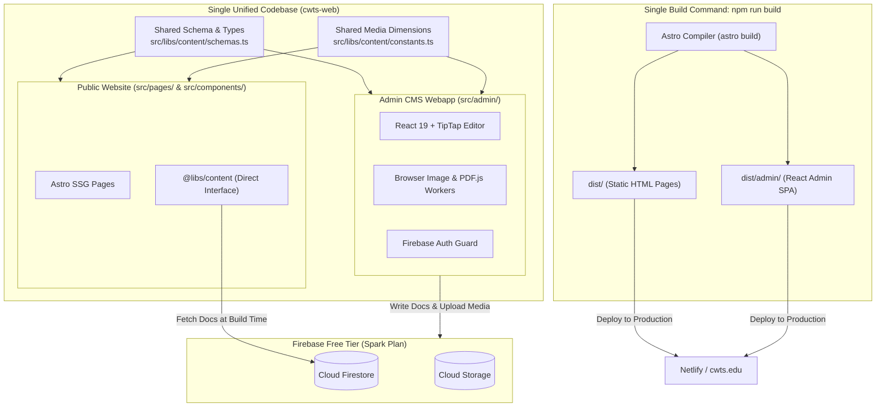
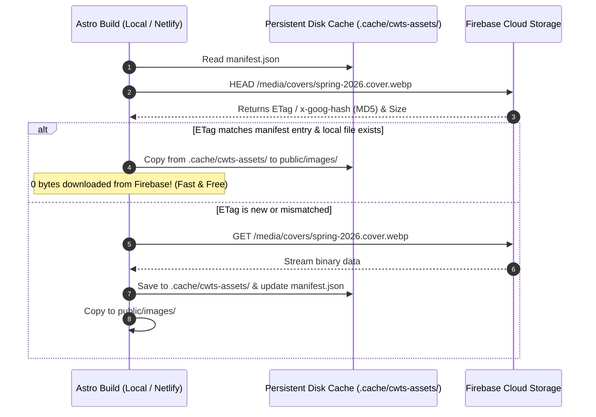
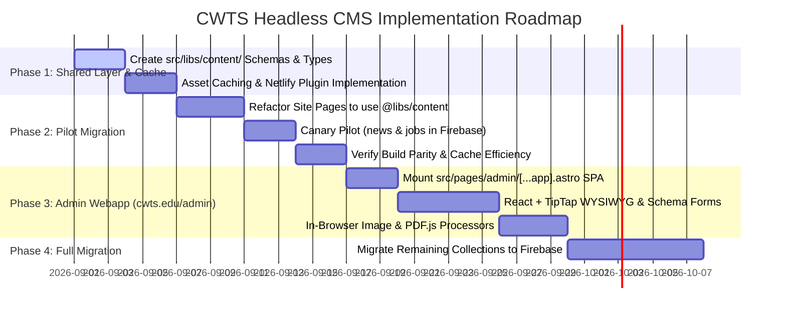

# Headless CMS Architecture & Progressive Migration Design Document

**Project:** Christian Witness Theological Seminary (CWTS) Website  
**Topic:** Headless CMS on Firebase Free Tier (Spark Plan), Unified Admin Webapp (`cwts.edu/admin`), Direct Content Interface, Shared Schemas & Cross-Build Caching  
**Target Environments:** Local Development + Netlify CI/CD + Firebase Spark Plan + Cloudflare Edge  
**Date:** August 2026  
**Status:** Architectural Specification & Implementation Plan  

---

## 1. Executive Summary & Core Architectural Shift

This document details the architectural design for transitioning the CWTS website to a **Firebase-backed Headless CMS Webapp** integrated directly into the codebase.

### The Core Architectural Principles:
1. **Unified Codebase & Build Pipeline (`cwts.edu/admin`):** The CMS Admin webapp is embedded as an Astro Client Island SPA under `src/admin/`. Running `npm run build` builds both the public SSG website and the Admin Webapp into `dist/` and `dist/admin/` with a single command.
2. **Zero Code Duplication (Shared Schema & Types):** The public site and the Admin app share the exact same Zod validation schemas (`src/libs/content/schemas.ts`), TypeScript types, media dimension constants, and Firebase client SDKs.
3. **Direct Content Interface (`@libs/content`):** The entire site code consumes content exclusively via a strongly-typed `IContentClient` interface (`content.news.list()`, `content.pages.getBySlug()`), completely isolated from `astro:content`.
4. **Pluggable & Hybrid Backends:** The underlying implementation is swappable (`FirebaseContentClient`, `AstroContentClient`, `HybridContentClient`), enabling safe, zero-risk progressive canary migrations (`news` and `jobs` first).
5. **Zero MDX Dependency:** Replaces all 8 components previously used across 57 `.mdx` files with TipTap Custom Nodes (Semantic HTML), Dedicated Astro Page Layouts, and Build-Time Rehype Plugins.
6. **Cross-Build Asset Caching:** Persistent ETag/MD5 metadata cache (`.cache/cwts-assets/`) on Local and Netlify CI/CD builds, guaranteeing **sub-second builds and near-zero Firebase Storage egress (100% within the Spark Free Tier).**
7. **Zero-Compute Free Tier (Spark Plan):** In-browser client-side Web Workers, Canvas, and PDF.js perform all image resizing and PDF cover rendering prior to upload.

---

## 2. High-Level Architecture & Unified Build System



---

## 3. Unified Codebase Structure & Admin Webapp (`cwts.edu/admin`)

The Admin Webapp lives inside `src/admin/` and is served at `cwts.edu/admin` via an Astro catch-all client route.

### 3.1 Directory Structure
```
cwts-web/
├── public/
│   ├── _redirects                  # Netlify redirect: /admin/* -> /admin/index.html 200
│   └── favicon.svg
├── src/
│   ├── admin/                      # React CMS Admin Single-Page App (SPA)
│   │   ├── App.tsx                 # Root Router & Auth State Guard
│   │   ├── components/
│   │   │   ├── layout/             # Admin Header, Sidebar, Navigation
│   │   │   ├── editor/             # TipTap WYSIWYG Editor + Toolbar
│   │   │   │   ├── extensions/     # Custom TipTap Nodes (PDFCard, Accordion, Video)
│   │   │   │   └── TipTapEditor.tsx
│   │   │   ├── forms/              # Dynamic Schema-Driven Forms (react-hook-form + zod)
│   │   │   │   ├── NewsForm.tsx
│   │   │   │   ├── JobForm.tsx
│   │   │   │   ├── FacultyForm.tsx
│   │   │   │   └── PageForm.tsx
│   │   │   └── media/              # Media Library & File Dropzone
│   │   │       ├── MediaLibraryModal.tsx
│   │   │       └── UploaderDropzone.tsx
│   │   ├── services/
│   │   │   ├── firebase.ts         # Client Firebase Auth, Firestore, Storage SDK
│   │   │   ├── imageProcessor.ts   # In-Browser Canvas / WASM Image Resizer
│   │   │   └── pdfProcessor.ts     # In-Browser PDF.js Cover Extractor
│   │   └── pages/
│   │       ├── Dashboard.tsx
│   │       ├── CollectionList.tsx
│   │       ├── EntryEditor.tsx
│   │       └── MediaManager.tsx
│   ├── libs/
│   │   └── content/                # SHARED DOMAIN LAYER
│   │       ├── schemas.ts          # Shared Zod Schemas & TypeScript Types
│   │       ├── constants.ts        # Shared Dimensions, Image Specs, Locales
│   │       ├── types.ts            # IContentClient Contract
│   │       ├── firebaseClient.ts   # Firestore Implementation
│   │       ├── astroClient.ts      # Local Fallback Implementation
│   │       ├── hybridClient.ts     # Progressive Migration Router
│   │       └── index.ts            # Master Content Singleton Export
│   └── pages/
│       ├── admin/
│       │   └── [...app].astro      # Astro Mount Point for Admin SPA
│       ├── index.astro
│       └── [language]/[...slug].astro
├── netlify.toml
└── package.json
```

---

### 3.2 Astro Mount Point: `src/pages/admin/[...app].astro`

A single Astro page prerenders the HTML shell for the Admin SPA. With `client:only="react"`, Astro compiles the entire React Admin app into bundled assets during `npm run build`:

```astro
---
// src/pages/admin/[...app].astro
import AdminApp from "@admin/App";

export function getStaticPaths() {
  // Generates /admin/index.html and supports client-side SPA routing
  return [
    { params: { app: undefined } },
    { params: { app: "index" } }
  ];
}
---

<!doctype html>
<html lang="zh-Hant">
  <head>
    <meta charset="UTF-8" />
    <meta name="viewport" content="width=device-width, initial-scale=1.0" />
    <title>CWTS Content Manager | 基督工人神學院 後台管理系統</title>
    <link rel="icon" type="image/svg+xml" href="/favicon.svg" />
    <meta name="robots" content="noindex, nofollow" />
  </head>
  <body class="bg-gray-100 text-gray-900 antialiased">
    <!-- Mount React Admin SPA with client:only to skip SSR for Auth-protected routes -->
    <AdminApp client:only="react" />
  </body>
</html>
```

### 3.3 Netlify SPA Routing Configuration (`public/_redirects`)
To allow direct browser navigation to sub-routes like `cwts.edu/admin/news/edit/123`:

```text
# public/_redirects
/admin/*    /admin/index.html    200
```

---

## 4. Shared Schema Registry & Type System

The public website and the CMS Admin webapp share the exact same Zod validation schemas and dimension constants from `src/libs/content/`.

### 4.1 Shared Dimension Constants (`src/libs/content/constants.ts`)

```typescript
// src/libs/content/constants.ts
export const MEDIA_SPECS = {
  cover: { width: 1440, height: 1080, quality: 80, darken: { brightness: 0.4, saturation: 0.4 }, ext: '.cover.webp' },
  thumbnail: { width: 600, height: 350, quality: 80, ext: '.thumbnail.webp' },
  news: { width: 400, height: 220, quality: 85, ext: '.news.webp' },
  carousel: { width: 2560, height: 1067, quality: 90, ext: '.carousel.webp' },
  pdfCover: { height: 528, ext: '.pdf.cover.png' }
} as const;

export const SUPPORTED_LANGUAGES = ['zh', 'en'] as const;
export const DEFAULT_LANGUAGE = 'zh' as const;
```

### 4.2 Shared Zod Schemas (`src/libs/content/schemas.ts`)

These schemas are used by:
1. **Admin CMS:** To validate form input dynamically with `react-hook-form` + `@hookform/resolvers/zod`.
2. **Public Website:** To validate Firestore documents at build time and infer TypeScript types.

```typescript
// src/libs/content/schemas.ts
import { z } from "zod";

export type Language = "zh" | "en";
export type FacultyCategory = "faculty" | "senior-adjunct" | "adjunct";
export type DegreeCategory = "doctor" | "master" | "diploma" | "certificate";

// 1. Pages Schema
export const PageMetadataSchema = z.object({
  title: z.string().min(1, "Title is required"),
  order: z.number().default(100),
  coverImage: z.string().optional(),
  thumbnail: z.string().optional(),
  showChildren: z.boolean().default(false),
});
export type PageMetadata = z.infer<typeof PageMetadataSchema>;

// 2. News Schema
export const NewsMetadataSchema = z.object({
  title: z.string().min(1, "Title is required"),
  date: z.coerce.date(),
  thumbnail: z.string().min(1, "Thumbnail is required"),
  url: z.string().min(1, "Target URL or slug is required"),
});
export type NewsMetadata = z.infer<typeof NewsMetadataSchema>;

// 3. Faculty Schema
export const FacultyMetadataSchema = z.object({
  photo: z.string().optional(),
  name: z.string().min(1, "Name is required"),
  category: z.enum(["faculty", "senior-adjunct", "adjunct"]),
  order: z.number().optional(),
  email: z.string().email().optional().or(z.literal("")),
  positions: z.array(z.string()).optional(),
  courses: z.array(z.string()).default([]),
  degrees: z.array(z.string()).default([]),
  moreDegrees: z.array(z.string()).optional(),
  former: z.array(z.string()).optional(),
});
export type FacultyMetadata = z.infer<typeof FacultyMetadataSchema>;

// 4. Degrees Programs Schema
export const DegreeProgramMetadataSchema = z.object({
  title: z.string().min(1, "Title is required"),
  order: z.number().default(1),
  thumbnail: z.string().optional(),
  length: z.string().optional(),
  credits: z.number().default(0),
  category: z.enum(["doctor", "master", "diploma", "certificate"]),
  redirect: z.string().optional(),
});
export type DegreeProgramMetadata = z.infer<typeof DegreeProgramMetadataSchema>;

// 5. Jobs Schema
export const JobMetadataSchema = z.object({
  title: z.string().min(1, "Title is required"),
  location: z.string().min(1, "Location is required"),
  date: z.coerce.date(),
  file: z.string().optional(),
});
export type JobMetadata = z.infer<typeof JobMetadataSchema>;

// Central Collection Registry
export interface ContentSchemaMap {
  pages: PageMetadata;
  news: NewsMetadata;
  faculty: FacultyMetadata;
  "adjunct-prof": FacultyMetadata[];
  "degrees-programs": DegreeProgramMetadata;
  jobs: JobMetadata;
  carousel: Array<{ link?: string; image: string; newWindow?: boolean }>;
  shortcuts: { zh: Array<{ name: string; url: string }>; en: Array<{ name: string; url: string }> };
  translation: Record<string, { zh: string; en: string }>;
  menu: Array<{ name?: string; page?: string; url?: string; children?: any[] }>;
  assembly: { semester: string; date: string; speaker: string; title: string; scripture: string; videoUrl?: string; audioUrl?: string };
}
```

---

## 5. Admin App UI & Form Generation (`src/admin/`)

Because forms import the Zod schemas directly, the form editor provides instant type-safe validation:

```tsx
// src/admin/forms/NewsForm.tsx
import React from "react";
import { useForm } from "react-hook-form";
import { zodResolver } from "@hookform/resolvers/zod";
import { NewsMetadataSchema, type NewsMetadata } from "@libs/content/schemas";
import { TipTapEditor } from "../components/editor/TipTapEditor";
import { MediaPickerInput } from "../components/media/MediaPickerInput";

interface Props {
  initialData?: NewsMetadata & { bodyHtml?: string };
  onSubmit: (data: NewsMetadata, bodyHtml: string) => Promise<void>;
}

export const NewsForm: React.FC<Props> = ({ initialData, onSubmit }) => {
  const [bodyHtml, setBodyHtml] = React.useState(initialData?.bodyHtml || "");
  const { register, handleSubmit, setValue, watch, formState: { errors, isSubmitting } } = useForm<NewsMetadata>({
    resolver: zodResolver(NewsMetadataSchema),
    defaultValues: initialData || {
      title: "",
      date: new Date(),
      thumbnail: "",
      url: "",
    },
  });

  return (
    <form onSubmit={handleSubmit((data) => onSubmit(data, bodyHtml))} className="space-y-6 max-w-4xl">
      <div>
        <label className="block text-sm font-medium text-gray-700">News Title</label>
        <input {...register("title")} className="mt-1 block w-full rounded border p-2" />
        {errors.title && <p className="text-red-500 text-xs mt-1">{errors.title.message}</p>}
      </div>

      <div className="grid grid-cols-2 gap-4">
        <div>
          <label className="block text-sm font-medium text-gray-700">Publish Date</label>
          <input type="date" {...register("date")} className="mt-1 block w-full rounded border p-2" />
        </div>
        <div>
          <label className="block text-sm font-medium text-gray-700">Target URL / Slug</label>
          <input {...register("url")} className="mt-1 block w-full rounded border p-2" />
        </div>
      </div>

      <MediaPickerInput
        label="Thumbnail Image"
        value={watch("thumbnail")}
        onChange={(url) => setValue("thumbnail", url)}
        variant="news"
      />

      <div>
        <label className="block text-sm font-medium text-gray-700 mb-2">Content Preview / Body</label>
        <TipTapEditor content={bodyHtml} onChange={setBodyHtml} />
      </div>

      <button type="submit" disabled={isSubmitting} className="px-6 py-2 bg-darkviolet text-white rounded font-medium hover:bg-purple-900">
        {isSubmitting ? "Saving..." : "Save News Item"}
      </button>
    </form>
  );
};
```

---

## 6. Client-Side Asset Processing (100% Spark Free Plan)

### 6.1 In-Browser Image Processor (`src/admin/services/imageProcessor.ts`)
When an editor drops an image in the CMS, it generates all required size variants in the browser using HTML5 Canvas & WebP compression:

```typescript
// src/admin/services/imageProcessor.ts
import { MEDIA_SPECS } from "@libs/content/constants";

export async function processImageVariants(file: File): Promise<Map<string, Blob>> {
  const img = await createImageBitmap(file);
  const results = new Map<string, Blob>();

  // Helper to resize canvas
  const renderVariant = async (w: number, h: number, quality: number, darken = false): Promise<Blob> => {
    const canvas = document.createElement("canvas");
    canvas.width = w;
    canvas.height = h;
    const ctx = canvas.getContext("2d")!;
    
    // Draw scaled center crop
    ctx.drawImage(img, 0, 0, w, h);
    
    if (darken) {
      ctx.fillStyle = "rgba(0, 0, 0, 0.4)";
      ctx.fillRect(0, 0, w, h);
    }

    return new Promise((resolve) => {
      canvas.toBlob((blob) => resolve(blob!), "image/webp", quality);
    });
  };

  results.set("cover", await renderVariant(MEDIA_SPECS.cover.width, MEDIA_SPECS.cover.height, 0.8, true));
  results.set("thumbnail", await renderVariant(MEDIA_SPECS.thumbnail.width, MEDIA_SPECS.thumbnail.height, 0.8));
  results.set("news", await renderVariant(MEDIA_SPECS.news.width, MEDIA_SPECS.news.height, 0.85));
  results.set("carousel", await renderVariant(MEDIA_SPECS.carousel.width, MEDIA_SPECS.carousel.height, 0.9));

  return results;
}
```

### 6.2 In-Browser PDF Cover Extractor (`src/admin/services/pdfProcessor.ts`)
```typescript
// src/admin/services/pdfProcessor.ts
import * as pdfjsLib from "pdfjs-dist";
import { MEDIA_SPECS } from "@libs/content/constants";

pdfjsLib.GlobalWorkerOptions.workerSrc = `https://cdnjs.cloudflare.com/ajax/libs/pdf.js/${pdfjsLib.version}/pdf.worker.min.js`;

export async function extractPdfCover(pdfFile: File): Promise<Blob> {
  const arrayBuffer = await pdfFile.arrayBuffer();
  const pdf = await pdfjsLib.getDocument({ data: arrayBuffer }).promise;
  const page = await pdf.getPage(1);
  
  const viewportUnscaled = page.getViewport({ scale: 1 });
  const scale = MEDIA_SPECS.pdfCover.height / viewportUnscaled.height;
  const viewport = page.getViewport({ scale });

  const canvas = document.createElement("canvas");
  canvas.width = Math.round(viewport.width);
  canvas.height = MEDIA_SPECS.pdfCover.height;

  const ctx = canvas.getContext("2d")!;
  await page.render({ canvasContext: ctx, viewport }).promise;

  return new Promise((resolve) => {
    canvas.toBlob((blob) => resolve(blob!), "image/png");
  });
}
```

---

## 7. Cross-Build Asset Caching (Local & Netlify CI/CD)



### 7.1 Cross-Build Persistence on Netlify CI/CD

Create `.netlify/plugins/netlify-plugin-cwts-cache/index.js`:

```javascript
// .netlify/plugins/netlify-plugin-cwts-cache/index.js
export const onPreBuild = async ({ utils }) => {
  const hasCache = await utils.cache.restore('.cache/cwts-assets');
  if (hasCache) {
    console.log(' Successfully restored CWTS asset cache from previous Netlify build!');
  } else {
    console.log(' No previous asset cache found. Will initialize fresh cache.');
  }
};

export const onPostBuild = async ({ utils }) => {
  const success = await utils.cache.save('.cache/cwts-assets');
  if (success) {
    console.log(' Successfully saved CWTS asset cache for subsequent Netlify builds!');
  }
};
```

Configure in `netlify.toml`:
```toml
# netlify.toml
[build]
  command = "npm run build"
  publish = "dist"

[[plugins]]
  package = "./.netlify/plugins/netlify-plugin-cwts-cache"
```

---

## 8. MDX Replacement & Rich Content Strategy

### 8.1 Replacement Matrix for Current 57 `.mdx` Files

| Existing MDX Component | Current Usage in `.mdx` | Headless CMS Replacement Pattern |
| :--- | :--- | :--- |
| **`AccordionItem.astro`** | `<AccordionItem name="m" open><h1 slot="summary">...</h1>...</AccordionItem>` | **TipTap Accordion Node**: Renders native HTML5 `<details class="accordion-item"><summary>...</summary><div>...</div></details>`. Zero JS needed, 100% accessible. |
| **`Pdf.astro`** | `<Pdf url="..." title="..." />` | **TipTap PDF Card Node**: Outputs `<figure class="pdf-embed"><figcaption><a href="...">Title</a></figcaption><object data="..." ...></object></figure>`. |
| **`Youtube.astro`** & **`Vimeo.astro`** | `<Youtube id="..." />`, `<Vimeo id="..." />` | **TipTap Video Extension**: Outputs responsive video embed markup. |
| **`Figure.astro`** | `<Figure imageUrl="..." title="..." />` | **TipTap Figure Node**: Native HTML5 `<figure><figcaption>...</figcaption></figure>`. |
| **`NewsletterList.astro`** | `<NewsletterList />` in `newsletter.mdx` | **Dedicated Astro Route Template**: The page template `src/pages/[language]/news-events/newsletter.astro` renders the CMS editorial copy and appends `<NewsletterList />`. |
| **`CsvTable.astro`** | `<CsvTable csv={csvData(...)} />` in `assembly.mdx` | **Dedicated Astro Route Template**: The page template `src/pages/[language]/student-life/assembly.astro` renders the CMS copy and dynamically renders `/assembly` database collection items. |
| **`ObfuscatedEmail`** | `<ObfuscatedEmail email="..." />` in `administration.mdx` | **Global Build-Time Rehype Plugin**: Editors write standard emails/links in the CMS; an Astro Rehype plugin automatically obfuscates all `mailto:` links site-wide at build time. |

---

## 9. Firebase Free Tier (Spark Plan) Quota Verification

| Resource | Spark Free Quota | CWTS Usage (Est.) | Status |
| :--- | :--- | :--- | :--- |
| **Firestore Storage** | 1 GB | ~20 MB (500 docs) | **2.0% used** |
| **Firestore Daily Reads** | 50,000 / day | ~500–2,000 / day | **1.0%–4.0% used** |
| **Firestore Daily Writes** | 20,000 / day | ~50 / day | **0.25% used** |
| **Storage Capacity** | 5 GB | ~2.0 GB | **40.0% used** |
| **Storage Daily Egress** | 1 GB / day | **~0 MB** (Cached on Netlify & Local builds) | **< 1.0% used** |
| **Auth MAU** | 50,000 / month | 10 accounts | **0.02% used** |
| **Cloud Functions** | *Requires Blaze* | **0 Functions used** | **100% Spark Compliant** |

---

## 10. Step-by-Step Implementation Roadmap



### Action Plan Summary:
1. **Step 1:** Create `src/libs/content/` defining shared Zod schemas (`schemas.ts`), constants (`constants.ts`), and the `IContentClient` interface.
2. **Step 2:** Refactor Astro pages to consume `@libs/content` directly, decoupling them from `astro:content`.
3. **Step 3:** Mount the React CMS Admin SPA at `src/pages/admin/[...app].astro` with `client:only="react"` so `npm run build` compiles both the website and the admin webapp at `cwts.edu/admin`.
4. **Step 4:** Build the React + TipTap WYSIWYG editor and in-browser image/PDF processors using the shared schemas and dimension constants.
5. **Step 5:** Pilot `news` and `jobs` in Firebase via `HybridContentClient`.
6. **Step 6:** Progressively migrate the remaining collections.
