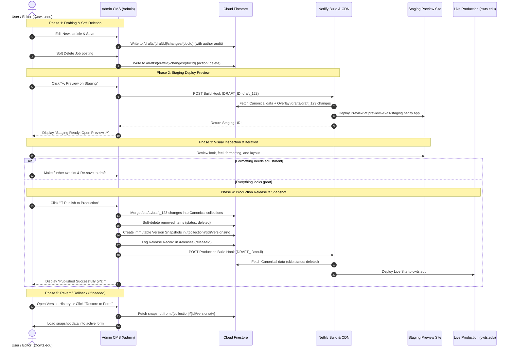
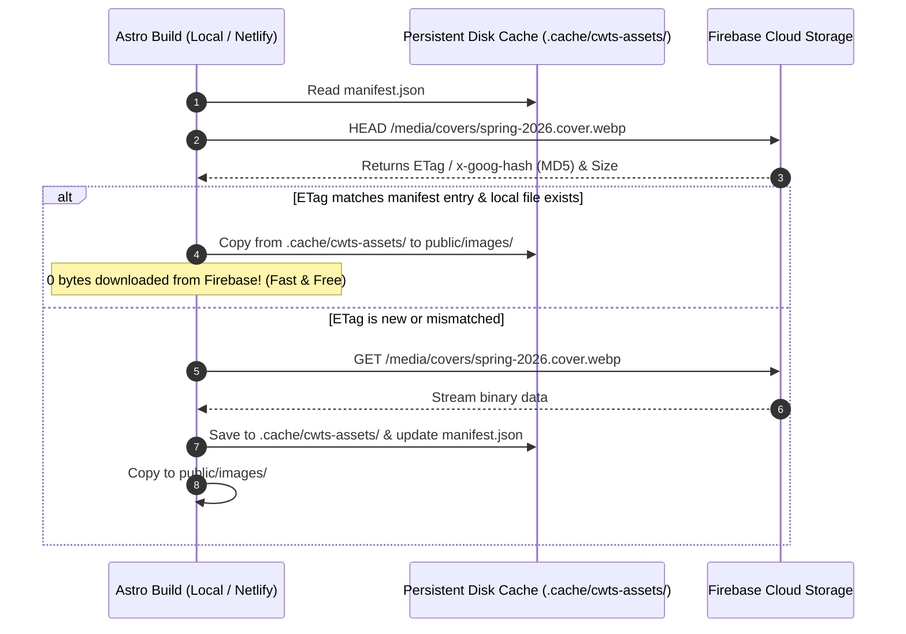

# Headless CMS Architecture & Progressive Migration Design Document

**Project:** Christian Witness Theological Seminary (CWTS) Website  
**Topic:** Headless CMS on Firebase Free Tier (Spark Plan), Unified Admin Webapp (`cwts.edu/admin`), Direct Content Interface, Draft Workspaces, Netlify Staging Preview, Immutable Version History & Production Release Pipeline  
**Target Environments:** Local Development + Netlify CI/CD + Firebase Spark Plan + Cloudflare Edge  
**Date:** August 2026  
**Status:** Implemented Architectural Specification  

---

## 1. Executive Summary & Core Architectural Shift

This document details the architectural design for the CWTS website's **Firebase-backed Headless CMS Webapp** integrated directly into the codebase.

### The Core Architectural Principles:
1. **Unified Codebase & Build Pipeline (`cwts.edu/admin`):** The CMS Admin webapp is embedded as an Astro Client Island SPA under `src/admin/`. Running `npm run build` builds both the public SSG website and the Admin Webapp into `dist/` and `dist/admin/` with a single command.
2. **Zero Code Duplication (Shared Schema & Types):** The public site and the Admin app share the exact same Zod validation schemas (`src/libs/content/schemas.ts`), TypeScript types, media dimension constants, and Firebase client SDKs.
3. **Direct Content Interface (`@libs/content`):** The entire site code consumes content exclusively via a strongly-typed `IContentClient` interface (`content.news.list()`, `content.pages.getBySlug()`), completely isolated from `astro:content`.
4. **Pluggable & Hybrid Backends:** The underlying implementation is swappable (`FirebaseContentClient`, `AstroContentClient`, `HybridContentClient`), enabling safe, zero-risk progressive canary migrations (`news` and `jobs` first).
5. **Stable Document Identity & In-Place Mutation:** Documents are permanently identified by their immutable `id`. Title or metadata edits modify the canonical document in-place rather than mutating the document ID. New items are automatically assigned `Date + Timestamp` identifiers (`${dateStr}-${Date.now().toString(36)}`), completely eliminating manual identifier inputs from the UI.
6. **Draft Workspaces & Accumulated Changes:** All edits made by an editor accumulate within a private Draft Workspace. Unfinished drafts do not affect the live website.
7. **Draft-Based Soft Deletion & Non-Destructive Versioning:** Deleting an item in the CMS registers an `action: "delete"` in the draft workspace with an instant **Undo Delete** action. Upon production publishing, the canonical document is soft-deleted (`status: "deleted"`) and an immutable snapshot version (`status: "deleted"`) is archived. Content queries automatically filter out soft-deleted items while preserving the complete audit history.
8. **Netlify Staging Deploy Preview & Progress Countdown:** A **"Preview"** action in the CMS triggers a Netlify Staging Build with the `DRAFT_ID`. Netlify overlays the draft changes onto canonical data, giving the editor a real, shareable staging URL to review before going live.
9. **Immutable Published Version History & Rollbacks:** Every published release automatically creates an immutable snapshot (`/{collection}/{id}/versions/{versionNumber}`). Editors can inspect past versions and restore form inputs or roll back releases in one click.
10. **Full HTML5 Browser History & Deep-Linking:** The Admin SPA utilizes the HTML5 History API (`pushState`, `popstate`) and maps to static Astro subroutes (`/admin/news`, `/admin/jobs/new`, `/admin/news/edit?id=...`), supporting browser Back/Forward navigation and bookmarked URLs.
11. **Cross-Build Asset Caching:** Persistent ETag/MD5 metadata cache (`.cache/cwts-assets/`) on Local and Netlify CI/CD builds, guaranteeing **sub-second builds and near-zero Firebase Storage egress (100% within the Spark Free Tier).**
12. **Zero-Compute Free Tier (Spark Plan):** In-browser client-side Web Workers, Canvas, and PDF.js perform all image resizing and PDF cover rendering prior to upload.

---

## 2. High-Level Architecture & Deployment Pipelines

```mermaid
flowchart TD
    subgraph ADMIN_PORTAL ["Admin CMS Webapp (cwts.edu/admin)"]
        AUTH["Whitelist Auth Guard<br/>(@cwts.edu & Admins)"]
        ROUTER["HTML5 History Router<br/>(/admin/news, /admin/jobs)"]
        FORMS["Zod Schema-Validated Editors<br/>(Auto Date+Timestamp ID)"]
        DRAFT_WS["Accumulated Draft Workspace<br/>(Create, Update, Soft-Delete)"]
        HISTORY["Version History & Rollback UI<br/>(v1, v2, v3... Revert to Draft)"]
    end

    subgraph FIRESTORE_DATABASE ["Cloud Firestore (Default DB)"]
        CANONICAL["Canonical Published Collections<br/>/news, /jobs, /faculty, /pages<br/>(status: published | deleted)"]
        VERSIONS["Immutable Version Snapshots<br/>/{collection}/{id}/versions/{v}"]
        DRAFTS["Draft Workspaces<br/>/drafts/{draftId}/changes/{docId}"]
        RELEASES["Release History Audit<br/>/releases/{releaseId}"]
    end

    subgraph NETLIFY_BUILDS ["Netlify CI / CD Pipelines"]
        STAGING_BUILD["Netlify Staging / Deploy Preview<br/>(DRAFT_ID=draft_xxx)"]
        PROD_BUILD["Netlify Production Build<br/>(DRAFT_ID=null)"]
    end

    subgraph SITES ["Target Environments"]
        STAGING_SITE["Staging Preview URL<br/>(preview--cwts-staging.netlify.app)"]
        PROD_SITE["Live Production Website<br/>(cwts.edu)"]
    end

    AUTH --> ROUTER
    ROUTER --> FORMS
    FORMS -->|1. Save Edits / Soft Delete| DRAFT_WS
    DRAFT_WS -->|Save Pending Changes| DRAFTS

    DRAFT_WS -->|2. Click 'Preview'| STAGING_BUILD
    DRAFTS & CANONICAL -->|Overlay Draft onto Canonical| STAGING_BUILD
    STAGING_BUILD --> STAGING_SITE
    STAGING_SITE -.->|Visual Review / Feedback| ADMIN_PORTAL

    DRAFT_WS -->|3. Click 'Publish'| CANONICAL
    CANONICAL -->|Snapshot Published / Deleted State| VERSIONS
    CANONICAL -->|Log Release Audit| RELEASES
    DRAFT_WS -->|Trigger Production Webhook| PROD_BUILD
    CANONICAL -->|Build Static HTML (Filter Deleted)| PROD_BUILD
    PROD_BUILD --> PROD_SITE

    VERSIONS -->|Restore Snapshot to Form| DRAFT_WS
```

---

## 3. Directory Structure & Admin Subroutes

The Admin Webapp lives inside `src/admin/` and is statically pre-rendered by Astro at `src/pages/admin/[...app].astro`.

### 3.1 Directory Layout
```
cwts-web/
├── public/
│   ├── _redirects                  # Netlify redirect: /admin/* -> /admin/index.html 200
│   └── favicon.svg
├── src/
│   ├── admin/                      # React CMS Admin Single-Page App (SPA)
│   │   ├── AdminApp.tsx            # Root Router (pushState/popstate) & App Container
│   │   ├── components/
│   │   │   ├── AdminLayout.tsx     # Admin Header, Sidebar, Navigation
│   │   │   ├── AuthGate.tsx        # Whitelist Access Guard & Login Modal
│   │   │   └── DraftReviewModal.tsx # Release Center & Deployment Progress Bar
│   │   ├── config/
│   │   │   ├── firebase.ts         # Firebase Client SDK
│   │   │   └── whitelist.ts        # Admin Email Whitelist Service
│   │   ├── context/
│   │   │   ├── AuthContext.tsx     # User & Whitelist Auth Context
│   │   │   └── DraftContext.tsx    # Active Draft Workspace Context & Batch Publish
│   │   ├── fixtures/
│   │   │   └── initialContent.ts   # Tracked TypeScript Initial Content Fixtures
│   │   ├── services/
│   │   │   ├── netlifyDeploy.ts    # Staging Preview & Production Hook Triggers
│   │   │   └── seedDatabase.ts     # In-Browser Firestore Initial Seeding Service
│   │   └── views/
│   │       ├── DashboardView.tsx   # Overview, One-Click Seeding & Release Center
│   │       ├── NewsListView.tsx    # News Table (Soft Delete & Undo)
│   │       ├── NewsEditView.tsx    # News Editor (Auto-ID, Draft Save, History)
│   │       ├── JobsListView.tsx    # Jobs Table (Soft Delete & Undo)
│   │       └── JobsEditView.tsx    # Jobs Editor (Auto-ID, PDF Support, History)
│   ├── libs/
│   │   └── content/                # SHARED DOMAIN LAYER
│   │       ├── schemas.ts          # Shared Zod Schemas & TypeScript Types
│   │       ├── constants.ts        # Shared Dimensions, Image Specs, Locales
│   │       ├── types.ts            # IContentClient Contract (with ContentStatus & AuditUser)
│   │       ├── firebaseClient.ts   # Firestore Client with Draft Overlay & Soft Delete Filter
│   │       ├── astroClient.ts      # Local Fallback Client
│   │       ├── hybridClient.ts     # Progressive Migration Router
│   │       └── index.ts            # Master Content Singleton Export
│   └── pages/
│       ├── admin/
│       │   └── [...app].astro      # Astro Mount Point for Admin SPA Subroutes
│       ├── index.astro
│       └── [language]/[...slug].astro
├── netlify.toml
└── package.json
```

### 3.2 URL Routing & History Sync
| URL Path | CMS View | Description |
| :--- | :--- | :--- |
| `/admin` or `/admin/dashboard` | `DashboardView` | Overview statistics, active draft summary, and database seeding |
| `/admin/news` | `NewsListView` | News articles table sorted newest first |
| `/admin/news/new` | `NewsEditView` | Create news article (auto-generates `YYYY-MM-DD-timestamp` ID) |
| `/admin/news/edit?id={id}` | `NewsEditView` | Edit existing news article (locks permanent document ID) |
| `/admin/jobs` | `JobsListView` | Church job board postings with soft delete support |
| `/admin/jobs/new` | `JobsEditView` | Create job posting (auto-generates `YYYY-MM-DD-timestamp` ID) |
| `/admin/jobs/edit?id={id}` | `JobsEditView` | Edit existing job posting (locks permanent document ID) |

---

## 4. Shared Schema Registry & Type System

All entities across the public website and the CMS Admin webapp share the exact same Zod validation schemas and dimension constants from `src/libs/content/`.

### 4.1 Shared Dimension Constants (`src/libs/content/constants.ts`)

```typescript
export const MEDIA_SPECS = {
  cover: { width: 1440, height: 1080, quality: 80, darken: { brightness: 0.4, saturation: 0.4 }, ext: '.cover.webp' },
  thumbnail: { width: 600, height: 350, quality: 80, ext: '.thumbnail.webp' },
  news: { width: 400, height: 220, quality: 85, ext: '.news.webp' },
  carousel: { width: 2560, height: 1067, quality: 90, ext: '.carousel.webp' },
  pdfCover: { height: 528, ext: '.pdf.cover.png' }
} as const;

export const SUPPORTED_LANGUAGES = ['zh', 'en'] as const;
export const DEFAULT_LANGUAGE = 'zh' as const;
```

### 4.2 Shared Zod Schemas (`src/libs/content/schemas.ts`)

```typescript
import { z } from "zod";

export const AuditUserSchema = z.object({
  uid: z.string(),
  email: z.string().email(),
  displayName: z.string().optional(),
  photoURL: z.string().optional(),
  timestamp: z.string(), // ISO String
});
export type AuditUser = z.infer<typeof AuditUserSchema>;

// 1. News Schema
export const NewsMetadataSchema = z.object({
  title: z.string().min(1, "Title is required"),
  date: z.coerce.date(),
  thumbnail: z.string().min(1, "Thumbnail is required"),
  url: z.string().min(1, "Target URL or slug is required"),
});
export type NewsMetadata = z.infer<typeof NewsMetadataSchema>;

// 2. Jobs Schema
export const JobMetadataSchema = z.object({
  title: z.string().min(1, "Title is required"),
  location: z.string().min(1, "Location is required"),
  date: z.coerce.date(),
  file: z.string().optional(),
});
export type JobMetadata = z.infer<typeof JobMetadataSchema>;

// 3. Faculty Schema
export const FacultyMetadataSchema = z.object({
  photo: z.string().optional(),
  name: z.string().min(1, "Name is required"),
  category: z.enum(["faculty", "senior-adjunct", "adjunct"]),
  order: z.number().optional(),
  email: z.string().email().optional().or(z.literal("")),
  positions: z.array(z.string()).optional(),
  courses: z.array(z.string()).default([]),
  degrees: z.array(z.string()).default([]),
  moreDegrees: z.array(z.string()).optional(),
  former: z.array(z.string()).optional(),
});
export type FacultyMetadata = z.infer<typeof FacultyMetadataSchema>;

// 4. Pages Schema
export const PageMetadataSchema = z.object({
  title: z.string().min(1, "Title is required"),
  order: z.number().default(100),
  coverImage: z.string().optional(),
  thumbnail: z.string().optional(),
  showChildren: z.boolean().default(false),
});
export type PageMetadata = z.infer<typeof PageMetadataSchema>;

// 5. Content Status
export type ContentStatus = "published" | "draft" | "deleted";
```

---

## 5. Draft Workspaces, Staging Preview, Soft Delete & Release Pipeline



### 5.1 Document Identity Strategy
- **Existing Documents:** Document IDs are immutable. Editing title, date, or other attributes modifies the existing document in-place and preserves `initialItem.id`.
- **New Documents:** Automatically assigned a unique ID composed of `Date + Timestamp` (e.g. `2026-09-01-ml8q9x`).

### 5.2 Soft Deletion Lifecycle
1. **Queued in Draft:** Clicking "Delete" records `action: "delete"` in `/drafts/{draftId}/changes/{coll}_{docId}`.
2. **Instant Undo:** The item remains visible in the list with `🔴 Pending Deletion (Draft)` and strike-through styling, alongside an **"↩️ Undo Delete"** button.
3. **Staging Preview:** Staging builds automatically filter out items marked with draft deletion.
4. **Production Publish:**
   - Canonical document is updated to `status: "deleted"`, `version: currentVer + 1`, `deletedBy: auditUser`, `deletedAt: ISOString`.
   - An immutable snapshot version is created in `/{collection}/{id}/versions/{version}` with `status: "deleted"`.
   - Canonical content queries (`IContentClient`) automatically skip `status: "deleted"` documents.

```json
// Example: Deleted Version Snapshot (/{collection}/{id}/versions/3)
{
  "version": 3,
  "status": "deleted",
  "data": {
    "title": "已截止 矽谷基督徒聚會傳道同工",
    "location": "Fremont, CA",
    "date": "2026-08-01T00:00:00.000Z"
  },
  "body": "本職缺已結束徵聘...",
  "deletedBy": {
    "email": "admin@cwts.edu",
    "displayName": "Seminary Admin",
    "timestamp": "2026-08-19T22:30:00.000Z"
  },
  "releaseId": "rel_20260819_223000",
  "createdAt": "2026-08-19T22:30:00.000Z"
}
```

---

### 5.3 Build-Time Draft Overlay in `FirebaseContentClient`

During Netlify SSG builds, `FirebaseContentClient` checks for the environment variable `DRAFT_ID`:

1. **Production Build (`DRAFT_ID=""`)**:
   - Queries canonical Firestore collections (`/news`, `/jobs`, `/pages`, etc.) and skips any document where `status === "deleted"`.
2. **Staging / Preview Build (`DRAFT_ID="draft_xxx"`)**:
   - Fetches canonical collections into memory.
   - Fetches `/drafts/${DRAFT_ID}/changes/*`.
   - **Overlays** the draft changes onto canonical records (merging updates, adding created docs, removing deleted docs).
   - Generates the staging static HTML reflecting the exact preview state.

```typescript
// src/libs/content/firebaseClient.ts (Draft Overlay Logic)
export class FirebaseContentClient implements IContentClient {
  private draftId?: string;

  constructor(options: { projectId: string; draftId?: string }) {
    this.draftId = options.draftId || process.env.DRAFT_ID;
  }

  async getCollection<K extends keyof ContentSchemaMap>(collection: K): Promise<ContentEntry<ContentSchemaMap[K]>[]> {
    // 1. Fetch canonical collection from Firestore (skipping status === "deleted")
    const canonicalEntries = await this.fetchCanonicalCollection(collection);

    // 2. If no active draft preview, return canonical
    if (!this.draftId) {
      return canonicalEntries;
    }

    // 3. Fetch draft overlay changes from /drafts/{draftId}/changes
    const draftChanges = await this.fetchDraftChanges(this.draftId, collection);
    
    // 4. Apply overlay
    const mergedMap = new Map(canonicalEntries.map(e => [e.id, e]));
    for (const change of draftChanges) {
      if (change.action === 'delete') {
        mergedMap.delete(change.documentId);
      } else {
        mergedMap.set(change.documentId, {
          id: change.documentId,
          slug: change.documentId,
          language: change.data.language || 'zh',
          status: 'draft',
          data: change.data,
          body: change.body,
          updatedAt: new Date(change.updatedBy.timestamp)
        });
      }
    }

    return Array.from(mergedMap.values());
  }
}
```

---

## 6. Client-Side Asset Processing (100% Spark Free Plan)

### 6.1 In-Browser Image Processor (`src/admin/services/imageProcessor.ts`)
When an editor drops an image in the CMS, all size variants (`.cover.webp`, `.thumbnail.webp`, `.news.webp`, `.carousel.webp`) are generated in the browser using HTML5 Canvas & WebP compression prior to upload:

```typescript
export async function resizeImageInBrowser(
  file: File,
  targetWidth: number,
  targetHeight: number,
  quality = 0.85
): Promise<Blob> {
  const img = await createImageBitmap(file);
  const canvas = document.createElement("canvas");
  canvas.width = targetWidth;
  canvas.height = targetHeight;
  const ctx = canvas.getContext("2d")!;
  
  // High-quality bicubic downscaling
  ctx.imageSmoothingEnabled = true;
  ctx.imageSmoothingQuality = "high";
  ctx.drawImage(img, 0, 0, targetWidth, targetHeight);
  
  return new Promise((resolve) => {
    canvas.toBlob((blob) => resolve(blob!), "image/webp", quality);
  });
}
```

---

## 7. Cross-Build Asset Caching (Local & Netlify CI/CD)



---

## 8. MDX Replacement & Rich Content Strategy

| Existing MDX Component | Current Usage in `.mdx` | Headless CMS Replacement Pattern |
| :--- | :--- | :--- |
| **`AccordionItem.astro`** | `<AccordionItem name="m" open><h1 slot="summary">...</h1>...</AccordionItem>` | **TipTap Accordion Node**: Renders native HTML5 `<details class="accordion-item"><summary>...</summary><div>...</div></details>`. Zero JS needed. |
| **`Pdf.astro`** | `<Pdf url="..." title="..." />` | **TipTap PDF Card Node**: Outputs `<figure class="pdf-embed"><figcaption><a href="...">Title</a></figcaption><object data="..." ...></object></figure>`. |
| **`Youtube.astro`** & **`Vimeo.astro`** | `<Youtube id="..." />`, `<Vimeo id="..." />` | **TipTap Video Extension**: Outputs responsive video embed markup. |
| **`Figure.astro`** | `<Figure imageUrl="..." title="..." />` | **TipTap Figure Node**: Native HTML5 `<figure><figcaption>...</figcaption></figure>`. |
| **`NewsletterList.astro`** | `<NewsletterList />` in `newsletter.mdx` | **Dedicated Astro Route Template**: The page template `src/pages/[language]/news-events/newsletter.astro` renders the CMS copy and appends `<NewsletterList />`. |
| **`CsvTable.astro`** | `<CsvTable csv={csvData(...)} />` in `assembly.mdx` | **Dedicated Astro Route Template**: The page template `src/pages/[language]/student-life/assembly.astro` renders the CMS copy and dynamically renders `/assembly` database collection items. |
| **`ObfuscatedEmail`** | `<ObfuscatedEmail email="..." />` in `administration.mdx` | **Global Build-Time Rehype Plugin**: Editors write standard emails/links in the CMS; an Astro Rehype plugin automatically obfuscates all `mailto:` links site-wide at build time. |

---

## 9. Firebase Free Tier (Spark Plan) Quota Verification

| Resource | Spark Free Quota | CWTS Usage (Est.) | Status |
| :--- | :--- | :--- | :--- |
| **Firestore Storage** | 1 GB | ~25 MB (500 docs + version history) | **2.5% used** |
| **Firestore Daily Reads** | 50,000 / day | ~500–2,000 / day | **1.0%–4.0% used** |
| **Firestore Daily Writes** | 20,000 / day | ~50 / day | **0.25% used** |
| **Storage Capacity** | 5 GB | ~2.0 GB | **40.0% used** |
| **Storage Daily Egress** | 1 GB / day (10 GB/mo on Blaze) | **~0 MB** (Cached on Netlify & Local builds) | **< 1.0% used** |
| **Auth MAU** | 50,000 / month | 10 accounts | **0.02% used** |
| **Cloud Functions** | *Requires Blaze* | **0 Functions used** | **100% Spark Compliant** |
